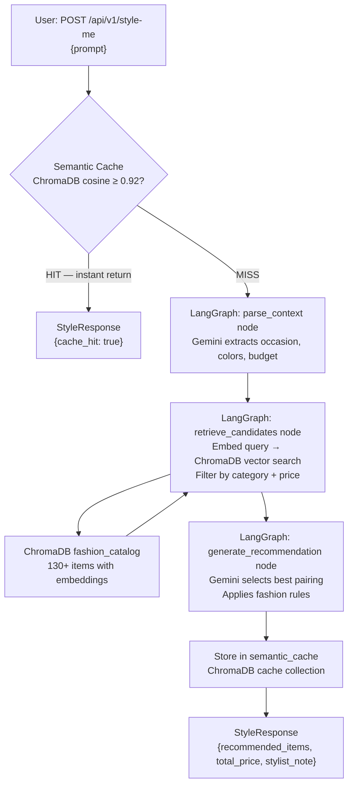

# Architecture

## System Overview

The Luxury Stylist Concierge is a four-layer pipeline: scrape → embed → reason → serve.

---

## System Flowchart



---

## State Management

Uses **LangGraph `StateGraph`** with a typed `StyleState` dict passed through each node:

```python
class StyleState(TypedDict):
    prompt: str           # raw user input
    user_context: dict    # parsed occasion, colors, budget
    candidates_tops: list # RAG results for tops
    candidates_bottoms: list # RAG results for bottoms
    recommendation: dict  # final LLM output
    error: Optional[str]
```

State is immutable between nodes — each node returns a new copy via `{**state, key: value}`. The compiled graph is a singleton (built once on first request).

---

## Database Schema

### Collection: `fashion_catalog`
Distance metric: **cosine**

| Field | Type | Notes |
|---|---|---|
| `id` | string | Unique item ID (e.g. `hm_001234`) |
| `embedding` | float[] | 384-dim `all-MiniLM-L6-v2` vector |
| `document` | string | `name + description` for retrieval |
| `name` | metadata string | Product name |
| `price` | metadata string | Display price (e.g. `$24.99`) |
| `price_float` | metadata float | Numeric price for `$lte` filtering |
| `category` | metadata string | `tops` or `bottoms` |
| `color` | metadata string | Inferred dominant color |
| `source` | metadata string | `H&M` or `ASOS` |
| `image_url` | metadata string | Product image |
| `url` | metadata string | Product page URL |

### Collection: `semantic_cache`
Distance metric: **cosine**

| Field | Type | Notes |
|---|---|---|
| `id` | string | SHA-256 hash prefix of prompt |
| `embedding` | float[] | Prompt embedding |
| `document` | string | Original prompt |
| `response_json` | metadata string | Serialized `StyleResponse` JSON |

---

## Prompt Optimization Strategies

### 1. Semantic Cache (Primary Saving)
Near-duplicate prompts (`cosine ≥ 0.92`) skip the LLM entirely and return the cached response in milliseconds. This is the single biggest token saver — a user asking the same or very similar styling question costs **$0**.

### 2. Dense, Structured Prompts
Both prompts (`CONTEXT_EXTRACTION_PROMPT`, `RECOMMENDATION_PROMPT`) are written to:
- Return **JSON only** — no preamble, no explanation — cutting output tokens by ~60%
- Use an **exact schema** in the prompt so the model doesn't invent fields
- Limit candidate descriptions to 80 chars in the recommendation prompt

### 3. Model Selection
`gemini-1.5-flash` is used over `gemini-1.5-pro` — it's 10× cheaper per token with minimal quality difference for structured formatting tasks.

### 4. Pre-filter Before LLM
The RAG layer retrieves only the **top-8** candidates per category (filtered by metadata), so the LLM prompt never grows beyond a fixed size regardless of catalog size.

---

## Folder Structure

```
quickeee-assignment/
├── scraper/
│   ├── hm_scraper.py       # Playwright async scraper — H&M tops + bottoms
│   ├── asos_scraper.py     # Scrapy spider — ASOS JSON API
│   ├── mock_data.py        # 65 tops + 65 bottoms fallback catalog
│   └── run_scrapers.py     # Orchestrator — runs both, fills gaps, saves catalog.json
├── rag/
│   ├── embedder.py         # sentence-transformers all-MiniLM-L6-v2
│   ├── vector_store.py     # ChromaDB client, upsert, filtered query
│   └── ingest.py           # catalog.json → ChromaDB (idempotent)
├── agent/
│   ├── prompts.py          # Minimal structured prompts
│   ├── cache.py            # Semantic cache read/write
│   └── workflow.py         # LangGraph state machine
├── api/
│   ├── models.py           # Pydantic request/response models
│   ├── router.py           # POST /api/v1/style-me
│   └── main.py             # FastAPI app + lifespan
├── data/
│   ├── catalog.json        # Scraped + merged product catalog
│   └── chroma_db/          # ChromaDB persistent storage
├── .env.example
├── requirements.txt
├── ARCHITECTURE.md
└── README.md
```
